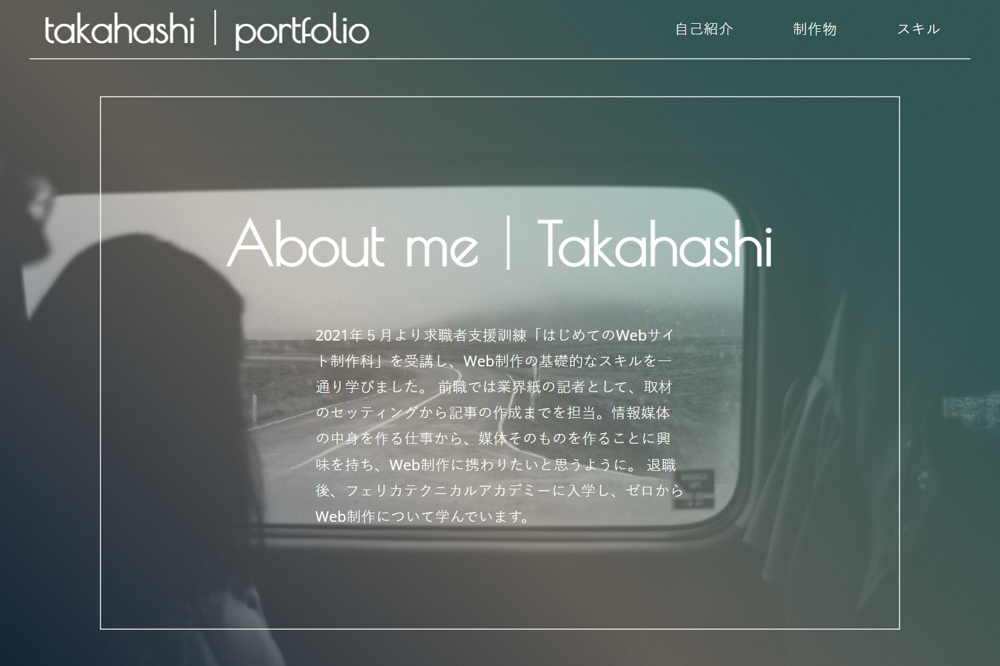

# Portfolio

## サイト概要
制作物やスキルをまとめたポートフォリオページ。一からコーディングしました。  
縦長のシングルページで制作物の概要やリンクを掲載しています。  
レスポンシブ対応しているので、スマートフォンからもご確認いただけます。  

## 自己紹介
2021年５月より求職者支援訓練「はじめてのWebサイト制作科」を受講し、  
Web制作の基礎的なスキルを一通り学びました。  
前職では業界紙の記者として、取材のセッティングから記事の作成までを担当。  
情報媒体の中身を作る仕事から、媒体そのものを作ることに興味を持ち、  
Web制作に携わりたいと思うようになりました。  
退職後、フェリカテクニカルアカデミーに入学し、ゼロからWeb制作について学んでいます。  

## スキル
### Web制作
- HTML5 , CSS3

    - 適切な見出しの設定と文書構造を記述できる。flexboxやpositionを使ったレイアウトの作成など。

    - 現在はSass(scss)でコーディングを行っており、ファイルをpartial化し、mixinを使用している。

- JavaScript , jQuery

    - if文とfor文、DOM操作、Ajaxでの外部ファイル読み込み、プラグインの使用が可能。

    - おみくじやじゃんけん程度のアプリケーションが作成できる。([CodePen](https://codepen.io/takahashi210517))

- php , WordPress

    - Google Formにデータだけ転送するフォームの作成、外部ファイル化したHTMLの読みこみ、  
    WordPressオリジナルテーマの作成ができる。

    - 環境構築にはXAMPPおよびLocal by Flywheelを使用したことがある。

- Git

    - 基礎的な操作が可能。リポジトリの作成、クローン/プル、ブランチ作成、プッシュなど。

    - 作業はVSCodeまたはSourceTreeで行っている。

- Photoshop

    - 基礎的な操作が可能。トリミングやアセット、アートボードの使用、バナー、カンプ作成など。

- Illustrator

    - 基礎的な操作が可能。バナー用の細かいパーツやロゴ、フライヤーの作成など。

### そのほか
- ライティング

    - 前職では600～800文字程度の記事を週4件作成していたため、  
    情報を正確に伝える文章を作成することが可能。

- Word

    - １ページ構成の簡単なビジネス文書を作成できる。

- Excel

    - グラフの作成や関数が使用できる。indexとmatchを組み合わせたデータの抽出など。

- Power Point

    - 簡単な資料作成が可能。図やグラフの挿入など。
